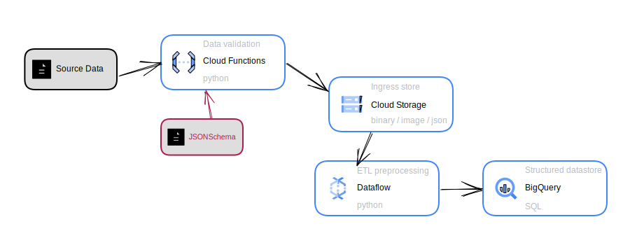

# Schema

A schema is a "blueprint" of what data looks like. More formally, it's an expression of descriptive and structural [metadata](live-edit-and-locked-edits.md) with defined [semantics](collections.md). A schema is a powerful communication tool, as it provides a clear and well-encapsulated expression of what data you have (or need).

By "defined semantics" we mean that it is expressed in a particular [schema language](schema-language.md), the choice of which can be highly nuanced depending on your application.


**Purpose**

Schema allow you to:

* de-risk projects involving data,
* build robust data [transformations](transformation.md) and [pipelines](pipeline.md), and
* communicate with other stakeholders about the data you require (or provide).



**Tip**

The **pure act of writing down what's in the data** is far more important than the selection of [schema language](schema-language.md).

Schemas can (in general) be translated between languages relatively easily; **the real value lies** in getting the data structure and description written down and communicated in the first place.



**Disambiguation**

In philosophy, a schema is a representation of a plan or theory in the form of an outline or model: "a schema of scientific reasoning". This is a much broader definition than we use for our purposes here.


## Example uses for schema



_Yes, you read this tab label correctly. Schema are an incredibly powerful de-risking tool for project management!_

In any data-driven project with several stakeholders, many months can be spent in communication on how teams are going to work together. Example chunks of data are sent back and forth in CSV or Excel files, and it's frequently unclear what expectations are and where boundaries lie between teams. The meanings of particular columns are queried by email, just when people go out on holiday. Things need fixing when it turns out the real data is a bit different. And so on, and so on, as **the critical path grows ever longer...**

****

<figure><figcaption>
Gantt charts have a habit of shifting ever-right in digitalisation projects. A perfect way of getting dependencies under control, and prevent teams blocking one another, is to workshop a set of schema at each of the boundaries at the beginning of the project.
</figcaption></figure>

At the beginning of such projects, defining a set of schema at the boundaries where data is exchanged between teams:

* Clarifies initial expectations&#x20;
* Encourages disciplined, effective communication between the teams as the project and its data evolve

This works well even if you don't yet have a clear understanding of your data (when schema are little more than a wild-guess!), because it introduces a framework for communication at the start.



For many kinds of [data transformation](transformation.md), it's imperative that the input data has some kind of characteristic. For example, if you run a wind resource analysis, your input data must contain at least some information about the wind at a site!

> But what if it doesn't? Or it's not in the right form?

This is where schema come in. If you have a schema then you can use it to:

* Check that the incoming data is valid
* Issue coherent and useful error messages if it isn't.

This is in contrast to accepting any kind of data, then behaving in undefined ways depending on what's in the data. Hence, it allows you to build robust data transformations more rapidly.

<figure><figcaption>
An example architecture diagram, in which a schema is used to validate data and return errors to user before accepting data for processing, launching a <a href="pipeline.md">pipeline</a> for <a href="transformation.md">transformation</a> with dataflow then persisting the output to a database
</figcaption></figure>



A schema for a relational database (such as [PostgreSQL](https://www.postgresql.org/)) describes how data is stored, by specifying tables, columns, column types and relations.

Database schema are generally required to be in a language specific to the type of database.

<figure><figcaption>
Graphical representation of a simple SQL database schema, from <a href="https://www.codecademy.com/learn/how-do-i-make-and-populate-my-own-database/modules/designing-a-database-schema/cheatsheet">codeacademy</a>.
</figcaption></figure>



## Standardisation and evolution

Industrial standards frequently emerge specifying data contents, often for stable industrial systems whose parameters and data outputs are well known.

\
